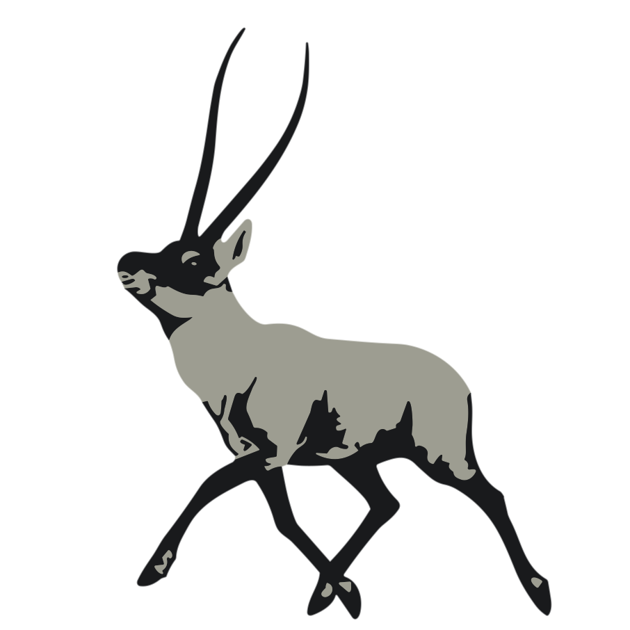

# Chiru

[](https://www.rust-lang.org/)
[](https://raw.githubusercontent.com/Qiu-Weidong/Chiru/main/LICENSE)

English | [简体中文](README.zh-Hans.md) | [繁體中文](README.zh-Hant.md)

A parser generator similar to [antlr4](https://github.com/antlr/antlr4.git).

## install
```shell
cargo install chiru
```


